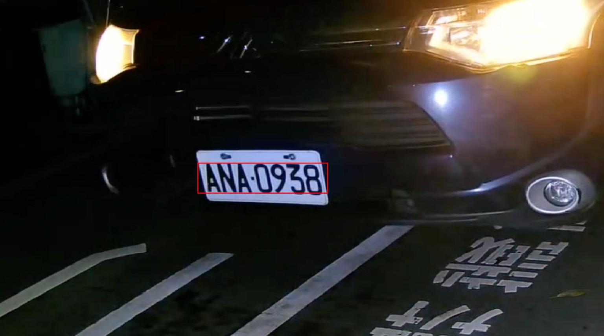
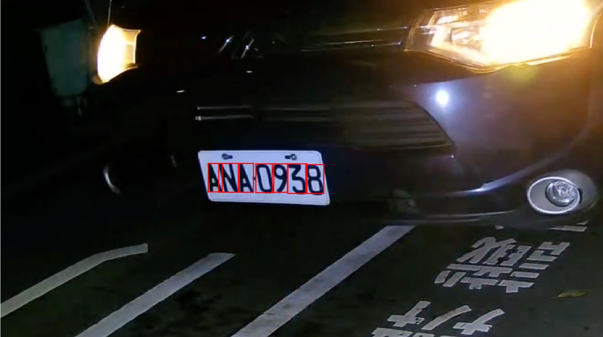

# 車牌偵測license-detect
### 使用Matlab實作，步驟可分2大類
1. 車牌定位
2. 字元切割

### 一、車牌定位
- 轉成灰階影像
- 中間值濾波器去除雜訊
- 找直的邊緣並做二值化
- 用3*20的結構對圖先關閉，之後開啟
- 連通區域標記(4-連接)
- 找出矩形，並選出面積大小和長寬比相似於車牌的區域

### 二、字元切割
- 轉成灰階影像
- 二值化並4連接
- 左右收縮，去除車牌外的區域
- 找出矩形，並過濾掉高度太矮和長寬比不合理的區域

### 遇到問題及解決辦法
  詳細請看[pdf](./%E5%BD%B1%E5%83%8F%E8%99%95%E7%90%86%E5%B0%8E%E8%AB%96-%E8%BB%8A%E7%89%8C%E5%81%B5%E6%B8%AC.pdf)
