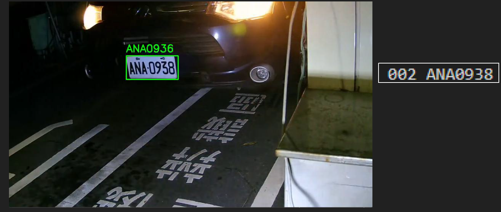

# 車牌辨識license-recognition
### 使用OpenCV實作，步驟可分3大類
1. 車牌定位
2. 字元切割

### 一、車牌定位
- 轉成灰階影像
- 中間值濾波器去除雜訊
- 找直的邊緣並做二值化
- 用3*20的結構對圖先關閉
- 找出矩形，並選出面積大小和長寬比相似於車牌的區域
- 做字元偵測，過濾掉字元數太少的矩形區域

### 二、字元切割
- 轉成灰階影像
- 高斯過濾器
- 二值化
- 做直線與橫線的開運算，避免字與字連接
- 左右收縮，去除車牌外的區域
- 將傾斜的車牌翻正

### 三、字元辨識
- 使用 pytesseract
- 過濾掉非大寫或數字字元
- 計算字元長度平均值，並過濾不符合規定的辨識結果
- 對每個字元位置進行投票，找出最有可能的字元

### 遇到問題及解決辦法
  詳細請看[pdf](./report.pdf)
